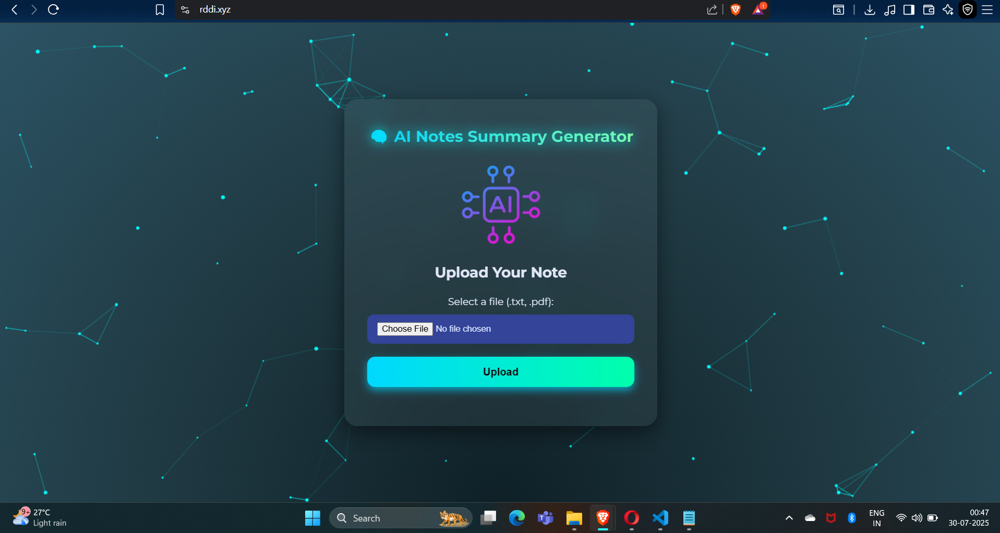
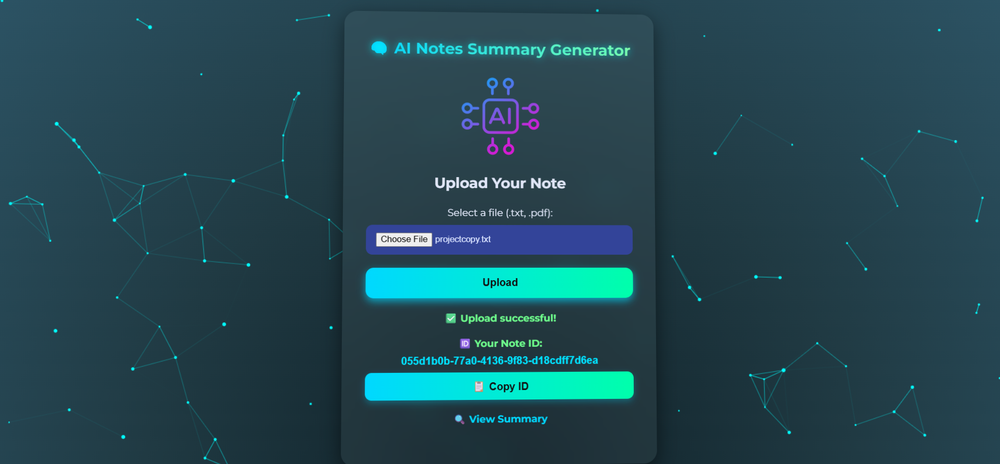
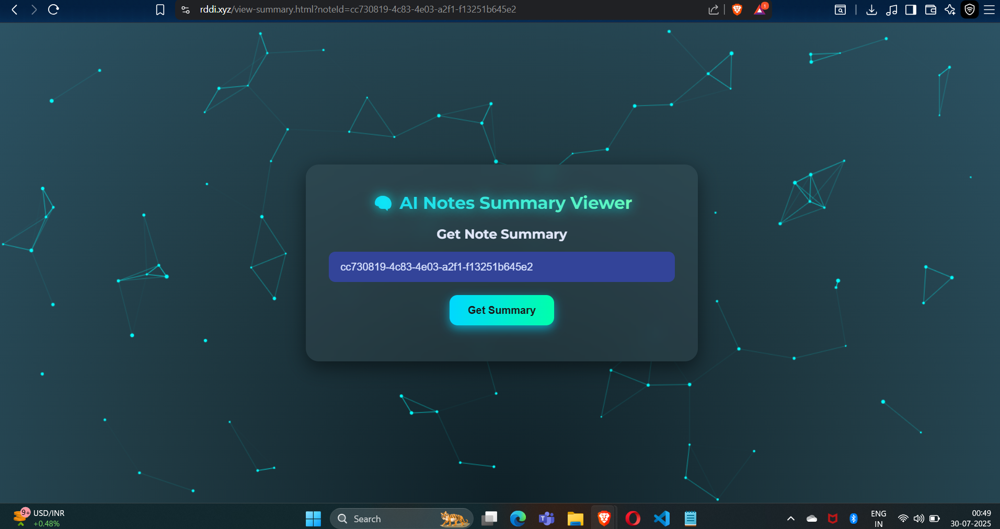
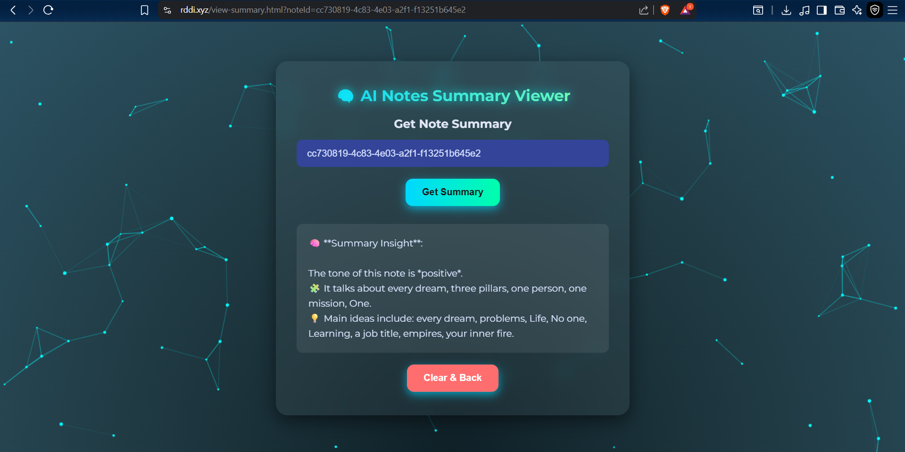
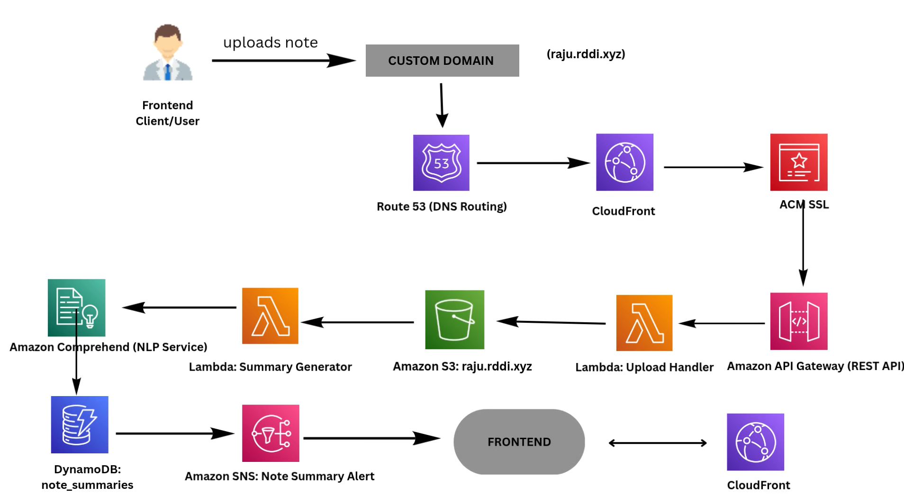

# 🧠 AI-Based Notes Summarizer & Cloud Share 📄☁️

This project uses **AWS Serverless Architecture** to allow users to upload notes (PDF/TXT), summarize them using **Meta LLaMA 3** via **Amazon Bedrock**, and optionally send the results via **SNS email**.

---

## 🚀 Features

- Upload PDF/TXT notes
- AI-generated summaries using LLaMA3
- Voice playback for summaries
- Summary storage in DynamoDB
- Email notification using SNS
- Fully Serverless (Lambda, API Gateway, S3, DynamoDB)
- CloudFormation for easy deployment

---

## 🖼️ Screenshots

### 📤 Upload Page

### 📤 upload-notes

### 📤 generate_unique_id

### view_summary_page

### 📋 Summary Page

---

## 👥 Project Team

This project is developed by a group of passionate developers as part of a cloud-based AI app initiative.

| Name         | Role                    | Email                    |
|--------------|-------------------------|---------------------------|
| Raju Dhuriya  | DevOps & Cloud Engineer | raju24devops@gmail.com    |
| Mangesh Kanaujiya | Frontend Developer   |mangeshkanaujiya2004@gmail.com       |
| Prince jaiswal  | Backend Developer      | princejaiswal@gmail.com       |

---

## 📦 Architecture Diagram

---

## 📁 Project Structure

📦ai-notes-summarizer
┣ 📁frontend
┃ ┣ upload.html
┃ ┣ view-summary.html
┃ ┗ ...
┣ 📁lambda
┃ ┣ upload-handler.zip
┃ ┣ summary-handler.zip
┣ 📁docs
┃ ┗ AINotesManual.pdf
┣ cloudformation.yaml
┗ README.md

---

## 📥 Deployment (One-Click via YAML)

> 🛠 Make sure to edit the following values inside `cloudformation.yaml`:
- Your S3 bucket name
- Lambda zip file names
- Email address for SNS
- Hosted Zone ID and domain (if using Route 53)

### 🔧 Step-by-Step to Deploy:

1. Go to [AWS CloudFormation Console](https://console.aws.amazon.com/cloudformation/)
2. Click **Create stack → With new resources (standard)**
3. Choose **Upload a template file**
4. Select `cloudformation.yaml`
5. Click **Next**, give a name like `AINotesStack`
6. Add your parameters:
   - `BucketName`
   - `SNS email`
   - `Hosted Zone ID`
7. Click **Next → Next → Create Stack**
8. Wait for **CREATE_COMPLETE**

---

## 🌐 CORS Instructions (If calling API from frontend)

1. Go to **API Gateway**
2. Select your API → Resources → `/upload` or `/get-summary`
3. Click **Actions → Enable CORS**
4. Select all headers: `GET, POST`, etc.
5. Deploy the API again

---

## ✅ Required IAM Permissions

Make sure your Lambda execution role has the following:
- `AmazonBedrockFullAccess`
- `AmazonDynamoDBFullAccess`
- `AmazonS3FullAccess`
- `AmazonSNSFullAccess`
- `AWSLambdaBasicExecutionRole`

---

## 📎 Documentation PDF

Full step-by-step manual available here:
👉 [docs/AI_Notes_Manual.pdf](docs/AI_Notes_Manual.pdf)

---

## 🙌 Thanks for using!

Feel free to contribute or fork this project for your own use.

